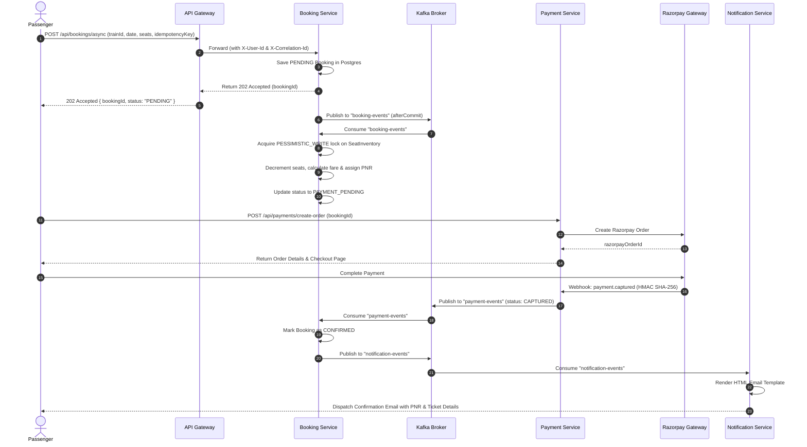

# 🚆 High-Concurrency Train Reservation & Payment Platform

<div align="center">


**A distributed, event-driven train ticketing and payment platform built to handle high-concurrency ticket reservations with strict consistency, zero-overselling guarantees, and asynchronous settlement.**

[Architecture](#-system-architecture) • [Engineering Highlights](#-key-engineering-highlights) • [Microservices](#-microservices-breakdown) • [Event Flow](#-event-driven-workflow) • [API Reference](#-api-endpoints) • [Local Setup](#-getting-started)

</div>

---

## 📌 Executive Overview

The **Train Reservation System** is an enterprise-grade microservices application designed for high-throughput transit booking. It handles burst traffic during ticket opening windows through **Kafka-driven asynchronous ingestion**, **database-level pessimistic locking (`PESSIMISTIC_WRITE`)**, **idempotency keys**, **Token-Bucket rate limiting**, and **Razorpay automated payment reconciliation**.

---

## 🏗 System Architecture

```mermaid
flowchart TB
    subgraph ClientLayer["🖥️ Frontend & Clients"]
        Client["React 19 + Vite Web App"]
    end

    subgraph EdgeLayer["🛡️ Edge & Security Layer"]
        Gateway["API Gateway (Port 8080)<br/>• Spring Cloud Gateway (Reactive)<br/>• JWT Authentication & RBAC<br/>• Bucket4j Rate Limiting (20 req/min)<br/>• Correlation ID Injection (X-Correlation-Id)"]
    end

    subgraph CoreServices["⚙️ Microservices Ecosystem"]
        UserService["👤 User Service (Port 8081)<br/>• JWT Token & Refresh Lifecycle<br/>• BCrypt Password Hashing<br/>• RBAC (USER / ADMIN)"]
        TrainService["🚆 Train Service (Port 8082)<br/>• Train Schedules & Routes<br/>• Station & Seat Configuration<br/>• Inter-Service Fare Matrix"]
        BookingService["🎟️ Booking Service (Port 8083)<br/>• Async Booking Worker<br/>• Pessimistic Lock (SELECT FOR UPDATE)<br/>• Idempotency Engine<br/>• After-Commit Tx Synchronization"]
        PaymentService["💳 Payment Service (Port 8084)<br/>• Razorpay Orders & Webhooks<br/>• HMAC-SHA256 Signature Verification<br/>• Payment Status Machine"]
        NotifService["📧 Notification Service (Port 8085)<br/>• Async Kafka Consumer<br/>• JavaMailSender / SMTP HTML Templates"]
    end

    subgraph EventStream["⚡ Event Streaming (Apache Kafka)"]
        K_Booking["Topic: booking-events"]
        K_Payment["Topic: payment-events"]
        K_Notif["Topic: notification-events"]
    end

    subgraph DataLayer["🗄️ Persistence Layer"]
        DB_User[("PostgreSQL: user_db")]
        DB_Train[("PostgreSQL: train_db")]
        DB_Booking[("PostgreSQL: booking_db")]
        DB_Payment[("PostgreSQL: payment_db")]
    end

    Client -->|HTTP / REST| Gateway
    Gateway -->|Forward with X-User-Id & X-Correlation-Id| UserService
    Gateway -->|Forward| TrainService
    Gateway -->|Forward| BookingService
    Gateway -->|Forward| PaymentService

    UserService --> DB_User
    TrainService --> DB_Train
    BookingService --> DB_Booking
    PaymentService --> DB_Payment

    BookingService -->|Synchronous RestClient Fare Lookup| TrainService
    BookingService -->|Produce BookingEvent (After-Commit)| K_Booking
    K_Booking -->|Async Ingest| BookingService

    PaymentService -->|Produce PaymentEvent| K_Payment
    K_Payment -->|Consume Status (CAPTURED / FAILED)| BookingService

    BookingService -->|Produce NotificationEvent| K_Notif
    K_Notif -->|Consume| NotifService
    NotifService -->|Fetch User Profile via RestTemplate| UserService
    NotifService -->|Send Email| SMTP["Mailtrap / SMTP Server"]
```

---

## 🚀 Key Engineering Highlights

### 1. High-Concurrency Seat Allocation & Zero-Overselling Guarantee
- **Pessimistic Locking (`SELECT ... FOR UPDATE`):** When concurrent requests attempt to reserve seats on the same train/date/class, Hibernate executes row-level pessimistic locks (`@Lock(LockModeType.PESSIMISTIC_WRITE)`).
- **Atomic Decrement:** Guarantees inventory never dips below zero even under massive concurrent surges.

```java
@Lock(LockModeType.PESSIMISTIC_WRITE)
@Query("SELECT s FROM SeatInventory s WHERE s.trainId = :trainId AND s.travelDate = :travelDate AND s.seatClass = :seatClass")
Optional<SeatInventory> findForUpdate(
    @Param("trainId") Long trainId,
    @Param("travelDate") LocalDate travelDate,
    @Param("seatClass") String seatClass
);
```

### 2. After-Commit Transaction Synchronization (Dual-Write Protection)
- Solves the distributed dual-write dilemma: Kafka events are published **only after** the local PostgreSQL transaction successfully commits via `TransactionSynchronizationManager.registerSynchronization(afterCommit)`.
- Eliminates orphan Kafka messages when database rollbacks occur.

### 3. Idempotent Reservation Architecture
- Unique client-supplied `idempotencyKey` stored on the database table.
- Duplicate retries caused by network timeouts return the existing reservation record with `200 OK` / `202 Accepted` instead of double-booking or charging twice.

### 4. Reactive Edge Gateway with Token-Bucket Rate Limiter
- **Spring Cloud Gateway (WebFlux):** Non-blocking reverse proxy routing.
- **Bucket4j + Caffeine:** In-memory token bucket rate limiter (20 requests/minute per client IP), returning `429 Too Many Requests` with `X-Rate-Limit-Remaining` and `X-Rate-Limit-Retry-After-Seconds` headers.
- **Context Injection:** Extracts validated JWT claims and enriches downstream requests with `X-User-Id` and `X-User-Roles`.

### 5. Distributed Tracing & Observability
- Seamless propagation of `X-Correlation-Id` from the Edge Gateway across HTTP filters, SLF4J MDC, and Kafka message headers for unified end-to-end request tracing.

### 6. Event-Driven Payment Reconciliation & Automated Inventory Rollback
- Integrated **Razorpay Payment Gateway** with HMAC-SHA256 signature verification on webhooks.
- If payment succeeds (`CAPTURED`), booking status transitions to `CONFIRMED`.
- If payment fails (`FAILED`) or expires, a Kafka event automatically triggers compensation logic in `BookingService`, incrementing `SeatInventory` back and releasing locked seats.

---

## 📦 Microservices Breakdown

| Service | Port | Primary Responsibilities | Core Stack |
| :--- | :---: | :--- | :--- |
| **`api-gateway`** | `8080` | Reverse proxy, JWT validation, Rate limiting, Correlation ID propagation | Spring Cloud Gateway, WebFlux, Bucket4j, Caffeine |
| **`user-service`** | `8081` | Authentication, RBAC, Refresh Tokens, Profile management | Spring Security, JJWT, PostgreSQL, Flyway |
| **`train-service`** | `8082` | Train scheduling, routes, stations, dynamic distance-based fare calculation | Spring Data JPA, RestClient, PostgreSQL, Flyway |
| **`booking-service`**| `8083` | Concurrency engine, Kafka producer/consumer, Pessimistic locking, PNR generation | Spring Boot, Apache Kafka, Spring Data JPA, PostgreSQL |
| **`payment-service`**| `8084` | Razorpay order creation, Webhook listener, HMAC-SHA256 signature validation | Razorpay SDK, Kafka, PostgreSQL, Flyway |
| **`notification-service`**| `8085`| Transactional HTML email dispatcher for confirmations and cancellations | JavaMailSender, Mailtrap, Kafka Listener |

---

## 🔄 Event-Driven Workflow



---

## 🔌 API Endpoints

### 🔐 Auth & User Service (`:8081`)
| Method | Endpoint | Access | Description |
| :--- | :--- | :--- | :--- |
| `POST` | `/api/auth/register` | Public | Register new passenger |
| `POST` | `/api/auth/login` | Public | Authenticate and receive JWT + Refresh Token |
| `POST` | `/api/auth/refresh-token` | Public | Rotate expired JWT access token |
| `GET` | `/api/users/me` | User / Admin | Retrieve authenticated user profile |

### 🚆 Train Service (`:8082`)
| Method | Endpoint | Access | Description |
| :--- | :--- | :--- | :--- |
| `GET` | `/train/trains` | Public | List all active trains |
| `GET` | `/train/search` | Public | Search trains between source & destination on date |
| `POST` | `/train/trains` | Admin | Register a new train & seat configurations |
| `GET` | `/train/internal/fare-info` | Internal | Calculate distance (km) and rate per km |

### 🎟️ Booking Service (`:8083`)
| Method | Endpoint | Access | Description |
| :--- | :--- | :--- | :--- |
| `POST` | `/api/bookings/async` | User | Asynchronous booking initiation (returns `202 Accepted`) |
| `GET` | `/api/bookings/{id}` | User | Poll booking status and reservation details |
| `POST` | `/api/bookings/cancel/{pnr}` | User | Cancel booking, release seats, and issue refund event |
| `GET` | `/api/seat-availability` | Public | Real-time seat inventory query |

### 💳 Payment Service (`:8084`)
| Method | Endpoint | Access | Description |
| :--- | :--- | :--- | :--- |
| `POST` | `/api/payments/create-order` | User | Create Razorpay order for booking |
| `POST` | `/api/payments/webhook` | Webhook | Process Razorpay payment status webhook |
| `GET` | `/api/payments/checkout/{bookingId}`| User | Render hosted Razorpay checkout script |

---

## 🛠️ Technology Stack

- **Core & Backend:** Java 21, Spring Boot 3.2 / 4.0, Spring Cloud Gateway, Spring Security, Spring Data JPA, Hibernate, Spring WebFlux
- **Messaging & Event Streaming:** Apache Kafka, Confluent Schema/Zookeeper
- **Caching & Rate Limiting:** Redis, Bucket4j, Caffeine Cache
- **Databases & Migrations:** PostgreSQL (Neon Serverless), Flyway DB Versioning
- **Payment & Integrations:** Razorpay API (HMAC SHA-256 Webhooks), JavaMailSender, Mailtrap
- **DevOps & Containers:** Docker, Docker Compose, Multi-stage builds
- **Documentation & Testing:** Swagger / SpringDoc OpenAPI 3, JUnit 5, Mockito
- **Frontend:** React 19, Vite, Framer Motion, Lucide Icons, React Router v7

---

## ⚡ Getting Started

### Prerequisites
- **JDK 21** or later
- **Maven 3.9+**
- **Docker & Docker Compose**
- **Node.js 20+** (for frontend)

### 1. Clone the Repository
```bash
git clone https://github.com/RishiKundar/train-booking-system.git
cd train-booking-system
```

### 2. Configure Environment Variables
Create a `.env` file in `./Backend` (or copy from `.env.example`):
```env
JWT_SECRET=your_super_secret_jwt_key_here_minimum_256_bits
DB_USERNAME=your_postgres_user
DB_PASSWORD=your_postgres_password
USER_DB_URL=jdbc:postgresql://ep-xxx.neon.tech/user_db?sslmode=require
TRAIN_DB_URL=jdbc:postgresql://ep-xxx.neon.tech/train_db?sslmode=require
BOOKING_DB_URL=jdbc:postgresql://ep-xxx.neon.tech/booking_db?sslmode=require
PAYMENT_DB_URL=jdbc:postgresql://ep-xxx.neon.tech/payment_db?sslmode=require
RAZORPAY_KEY_ID=rzp_test_xxxx
RAZORPAY_KEY_SECRET=xxxx
RAZORPAY_WEBHOOK_SECRET=xxxx
```

### 3. Launch All Services via Docker Compose
```bash
cd Backend
docker-compose up --build -d
```

This single command starts:
- 🛡️ API Gateway (`http://localhost:8080`)
- 👤 User Service (`http://localhost:8081`)
- 🚆 Train Service (`http://localhost:8082`)
- 🎟️ Booking Service (`http://localhost:8083`)
- 💳 Payment Service (`http://localhost:8084`)
- 📧 Notification Service (`http://localhost:8085`)
- ⚡ Zookeeper & Apache Kafka Broker (`localhost:29092`)

### 4. Run Frontend
```bash
cd ../Frontend
npm install
npm run dev
```
Open [http://localhost:5173](http://localhost:5173) in your browser.

---

## 📖 Swagger / OpenAPI Documentation

Each microservice exposes an interactive OpenAPI Swagger UI:
- **API Gateway Aggregated Docs:** `http://localhost:8080/swagger-ui.html`
- **User Service:** `http://localhost:8081/swagger-ui.html`
- **Train Service:** `http://localhost:8082/swagger-ui.html`
- **Booking Service:** `http://localhost:8083/swagger-ui.html`

---

## 👨‍💻 Author

**Rishi Kundar**
- 💼 LinkedIn: [linkedin.com/in/rishi-kundar](https://linkedin.com/in/rishi-kundar)
- 🐙 GitHub: [@RishiKundar](https://github.com/RishiKundar)
- 💡 LeetCode: [leetcode.com/u/RishiKundar](https://leetcode.com/u/RishiKundar)
- ✉️ Email: [rishi200117@gmail.com](mailto:rishi200117@gmail.com)

---

<div align="center">
  ⭐ If you found this project insightful, please give it a star on GitHub! ⭐
</div>
